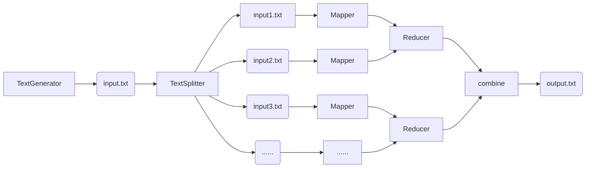
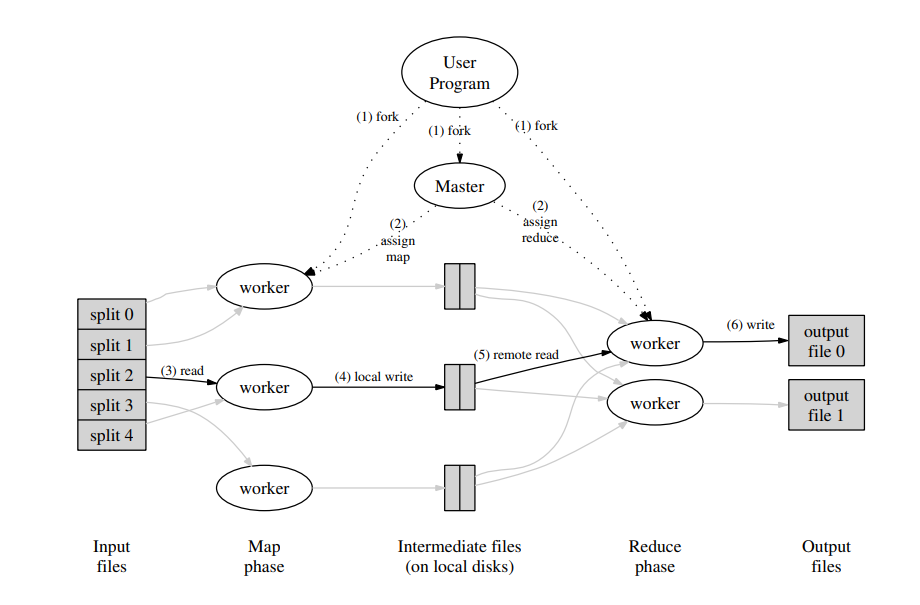

# Project8 Map Reduce

- Lu Tian - 3180103740
- Gu Yu - 3190105872

## 1. Project Description

MapReduce is a programming model and an associated implementation for processing and generating large data sets with a parallel, distributed algorithm on a cluster. A MapReduce program is composed of a Map() procedure and a Reduce() procedure.

In this project, you are supposed to briefly introduce the framework of MapReduce (How does it work?), and implement a MapReduce program to count the number of occurrences of each word in a set of documents. Your task includes the following steps:

- Setup MapReduce libraries. A popular open-source implementation is Apache Hadoop.
- Write a parallel MapReduce program and a serial program to solve this problem. You are supposed to print your results in non-increasing order of the number of occurrences of words. If two or more words have the same number of occurrences, they must be printed in lexicographical order. Make sure that each line contains one word, followed by its number of occurrences, separated by a space, and there must be no extra space at the end of each line.
- Prepare appropriate test data. A set of documents (files) which contains a minimum of 100,000 words must be used for testing.
- Test your programs; make sure that the results are accurate. Then compare and analyze the performances between parallel and serial algorithms.
- Note that the hardware, the scale of your set of documents, and setting of Hadoop (the number of Map Task and Reduce Task) may all have impact on the performance. You must give specific analysis on each factor.

[1]

## 2. Project Architecture

We implement this project in Java11 and use [Maven](https://maven.apache.org/) for project management and building automation. As a result, the project is organized in a "Maven" way. The test data is "input.txt", generated by com.demo.app.TextGenerator. The "input.txt" is split into "input_0.txt" to "input_8.txt" which is done by com.demo.app.TextSplitter for parallel execution of the tasks. The class com.demo.app.NaiveWordCount is the serial and naive implement of the WordCount. The class com.demo.app.WordCount which implements the map and reduce function is build to run in Apache HadoopMR framework. The package com.demo.app.diy.map reduce contains the class we design and implemented for our own map reduce program. And the classed within the package are self-contained(no need to rely on other map reduce library) and capable of performing the wordcount task in a map reduce way.

You can generate the test data and run the program if you want.

## 3. MapReduce Introduction

## 3.1 Overview

The term MapReduce can refer to multiple concepts:

1. The idea of processing a large amount data in a divide-and-conquer-like way in parallel
2. The distributed system that is capable of performing the idea in a hardware level(cluster of commodity machines)
3. The software framework the hide the complexity of managing the distributed system and let the programmer program in a rather easy way.

The typical situation is as follows: Users specify a map function that processes a key/value pair to generate a set of intermediate key/value pairs, and a reduce function that merges all intermediate values associated with the same intermediate key. And all these are usually accomplished with some well-refined MapReduce framework and executed on a cluster of the commodity machines.

## 3.2 The Model

The idea of MapReduce is similar to the idea divide-and-conquer in algorithm design. The task here can be generalize into two kinds:

1. Map, which is done before Reduce. Before mapping, the input data were firstly partitioned into unrelated parts and thus can be processing in parallel and generate the intermediate K-V pairs for the reduce task.
2. The worker of the Reduce task will take in the intermediate K-Vs generated before and output the final result of this MapReduce procedure. The output result could be used as the input for another round of MapReduce

- The input keys and values are drawn from a different domain than the output keys and values. Furthermore, the intermediate keys and values are from the same domain as the output keys and values.

## 3.3 The Implementation

Google presented the straightforward and elegant Implementation[2]. In this Implementation, Master is responsible for the well-functioning of the whole system and has an overall point of view of the whole system. The worker takes their computational responsibility under the command of master and only have limited information from their own perspective. The master thus becomes the single point of the system and the mechanism within it should be well designed.

Also, Google introduced many design ideas to make the system having better performance, being more fault-tolerant by keeping some degree of redundancy intentionally and utilizing the locality of information storage and processing.The refinements can be achieved in many ways:

1. Partitioning function
2. Making ordering guarantees
3. Combiner function that do partial merging before network flow
4. ......

## 4. Our Implementation

At first we tried to use the Hadoop MapReduce framework to implement our project. But it turns out to be a bad attempt. That's mainly because:

1. The framework hides the complexity of managing a distributed system away from the programmer who uses it to processing data. The freedom is somewhat deprived because of the restriction on the program model under the framework.
2. Some unnecessary optimization decided by the framework happens unexpectedly. If our input file size is small then framework will decide it's not worth parallelizing the execution and perform the computation in serial.
3. It is difficult for us do some optimization in the framework. For example, we wan't to cache the intermediate result in memory instead of create temp file, but we could't do it if we rely on the framework.
4. The framework is mainly developed for cluster of commodity devices or containers and has bad support for single machine with multiple cores.

As a result, we write our own map reduce program to solve the wordcount problem instead.

Our implementation mainly consists of three class:

- Mapper: The Mapper class perform the exact role as the mapper we discussed in section3 ------ processes the split file and generate the intermediate result.
- Reducer: The Reducer class is responsible for processing the intermediate result generated by the Mappers and aggregates them into the result K-V pairs.
- Main: The Main class is responsible for starting and closing the Mapper and Reducer threads. Also, the Main class needs to combine the K-V pairs generated by the Reducers, sort the K-V pairs in numeric and lexicographical order, format them and output the ultimate result.

Also, to optimize the performance of map reduce, we cache the intermediate result generated by mappers in main memory data structure instead of persist them on disk and launch some unnecessary disk I/O.

We also implement class NaiveWordCount, which functionality is rather simple and straightforward. It just loads the input.txt file from disk and counts the word one by one in serial.

## 5. Test

### 5.1 Test Environment & Test Data

We ran our test on a machine with

- AMD Ryzen 5 3550H with Radeon Vega Mobile Gfx @ 8x 2.1GHz
- 16.0 GB RAM
- SAMSUNG MZVLB512HBJQ-000L2 SSD

The test dataset is a randomly generated 253095 KB txt file(consists of 50,000,000 words). We also split the file into 8 almost equal size partition file for map reduce processing.

### 5.2 Test Result

Our tests mainly focus on how the number of mapper and reducer will affect the running time. We perform the test on the same dataset 10 times and take the average time of each situation. The result is as follows:

**serial word count**

| average running time(s)|
|------------------------|
|18.712                  |

**map reduce word count**

|mapper number  |reducer number   |average running time(s)|
|---------------|-----------------|------------------------|
|1              |1                |41.235                  |
|2              |1                |21.057                  |
|2              |2                |27.711                  |
|4              |1                |15.637                  |
|4              |2                |14.237                  |
|4              |4                |17.819                  |
|8              |1                |15.532                  |
|8              |2                |12.062                  |
|8              |4                |11.865                  |
|8              |8                |13.305                  |

### 5.3 Test Result Analysis

Ok, let's try to analyze and explain our test result here.

Firstly, we should be aware that the word count problem is I/O intensive and is mainly bounded to the performance of our disk. Secondly, our CPU can support up to 8 threads be executed simultaneous. If more threads are executed concurrently, OS has to do CPU time split and threads context switch. Also, because of thread-safe issue, we uses java.util.concurrent.LinkedBlockingQueue as the intermediate channel between mapper and reducer in our code.

Because the computation performed by the CPU is not the main limit of our program. It turns out that the serial approach in this situation isn't that bad, and even outperforms some map reduce procedure if it is not well configured. This is mainly because the serial model can take advantage of the sequence access of disk and eliminates the concurrent lock ovehead.

Also, we found that when the mapper number and reducer number are all 2(or all 4), the running time decrease a lot. That is mainly because of the overhead of the lock/unlock of the LinkedBlockingQueue.

When the sum of mapper and reducer threads exceeds the number of the maximum core-threads. The variance of the running time becomes rather significant. For example, when we have 8 mapper and 8 reducer, the test result running time is as follows:

11.583, 15.989, 15.053, 13.159, 13.133, 11.443, 13.654, 11.372, 11.901, 15.763

We think it's mainly because the schedule of the execution of mapper or reducer will be important under this situation. And it is scheduled by the OS and we can't do much about that.

## 6. Discussion & Conclusion

In this project, we design and implemented a map reduce program to solve the word count problem. After this project, we have a better understanding of the parallel algorithm. We also grow a keen interest in the system design and optimization.

## 7. References

[1] https://pintia.cn/problem-sets/1531166467503390720
[2] Dean, Jeffrey, and Sanjay Ghemawat. "MapReduce: simplified data processing on large clusters." Communications of the ACM 51.1 (2008): 107-113.
